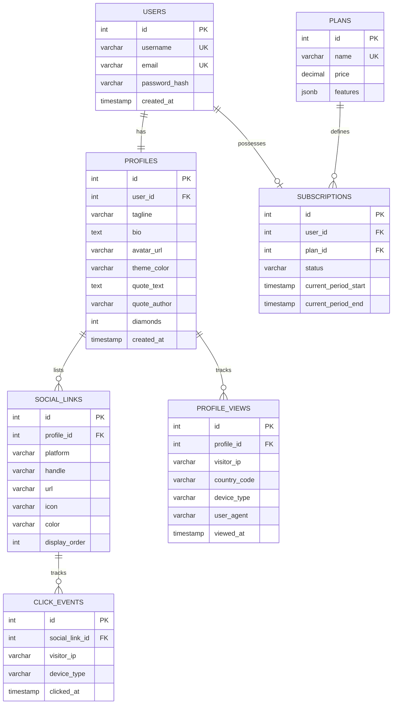
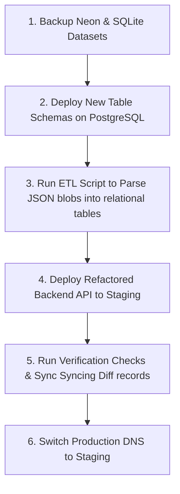
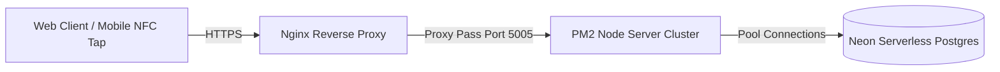

# Pertap: Production-Ready Architecture Refactor Plan

This document details the blueprint for refactoring the **Pertap** platform (Tapfolio NFC digital business card application) from a monolithic prototype (currently using JSON text blob storage and single-file routing) into a highly scalable, secure, and subscription-ready production architecture.

---

## 1. Target Folder Structure (WEB/)

To make the repository modular and maintainable, we will reorganize the folder structure as follows:

```
WEB/
├── public/
│   ├── nfc/                     # Static NFC public pages (HTML, CSS, JS)
│   ├── assets/                  # Global public assets (logos, icons)
│   └── uploads/                 # User uploaded avatars (cached/served statically)
│
├── src/                         # React Frontend Source
│   ├── assets/                  # Frontend assets (Vite processed)
│   ├── components/              # Reusable React components (Button, Input, Card, Modal)
│   │   ├── dashboard/           # Dashboard sub-components
│   │   └── common/              # Shared UI components
│   ├── pages/                   # Router page views (Home, Dashboard, Analytics, Login, Register)
│   ├── hooks/                   # Custom hooks (useAuth, useProfile, useAnalytics)
│   ├── contexts/                # React contexts (AuthContext, ThemeContext)
│   ├── services/                # API client connection modules (api.js, auth.js, profile.js)
│   ├── utils/                   # Frontend helpers (formatting, validation)
│   ├── App.jsx                  # Main router and shell layout
│   └── main.jsx                 # Client mounting point
│
├── routes/                      # Express Backend Route Routers
│   ├── auth.js                  # User registration, login, JWT issuance
│   ├── profile.js               # Read/write profile, usernames, and tags
│   ├── socials.js               # CRUD for link tiles
│   ├── analytics.js             # Analytics data aggregates (clicks, views, countries)
│   └── subscriptions.js         # Plan management, checkout, billing webhooks
│
├── database/                    # Database Connection & Migration Layer
│   ├── neon.js                  # Pool connection initialization to Neon PostgreSQL
│   ├── queries/                 # Structured SQL query files or services
│   └── migrations/              # SQL setup scripts and migration logic
│
├── middleware/                  # Request Processing Filters
│   ├── auth.js                  # JWT validation & user attachment
│   ├── validation.js            # Input validation constraints (Joi / Zod schemas)
│   └── rateLimiter.js           # API route protection limiters
│
├── services/                    # Backend Business Logic Layer
│   ├── auth.js                  # Password hashing and token utilities
│   ├── profile.js               # Profiles, custom tags and settings resolver
│   ├── analytics.js             # View and click event counters, country lookup
│   └── subscription.js          # Plan level authorization constraints
│
├── server.js                    # Core app entry point (Express app config & static mounting)
├── package.json                 # Project dependencies & script triggers
└── .env                         # Server environment configuration variables
```

---

## 2. Relational Database Schema Design (Neon PostgreSQL)

We will normalize the existing SQLite fallback and Neon PostgreSQL schema by replacing the single JSON `profile_data` field with relational tables. This setup ensures indexing, foreign key integrity, and enables complex SQL joins.

### Database Schema Entity-Relationship Layout



### SQL Definition Script (`database/migrations/001_init_schema.sql`)

```sql
-- Create users table
CREATE TABLE IF NOT EXISTS users (
    id SERIAL PRIMARY KEY,
    username VARCHAR(50) UNIQUE NOT NULL,
    email VARCHAR(255) UNIQUE NOT NULL,
    password_hash VARCHAR(255) NOT NULL,
    created_at TIMESTAMP DEFAULT CURRENT_TIMESTAMP
);

-- Indexing users by username for rapid public profile routing lookup
CREATE INDEX IF NOT EXISTS idx_users_username ON users(username);

-- Create profiles table
CREATE TABLE IF NOT EXISTS profiles (
    id SERIAL PRIMARY KEY,
    user_id INTEGER UNIQUE NOT NULL REFERENCES users(id) ON DELETE CASCADE,
    tagline VARCHAR(255) DEFAULT 'Let''s connect!',
    bio TEXT,
    avatar_url VARCHAR(255) DEFAULT '/profile_avatar.png',
    theme_color VARCHAR(20) DEFAULT '#0052ff',
    quote_text TEXT DEFAULT 'Design is not just what it looks like, it''s how it connects.',
    quote_author VARCHAR(100),
    diamonds INTEGER DEFAULT 0,
    created_at TIMESTAMP DEFAULT CURRENT_TIMESTAMP
);

-- Create tags table to hold customizable capsules stacked next to the avatar
CREATE TABLE IF NOT EXISTS profile_tags (
    id SERIAL PRIMARY KEY,
    profile_id INTEGER NOT NULL REFERENCES profiles(id) ON DELETE CASCADE,
    tag_text VARCHAR(100) NOT NULL,
    tag_type VARCHAR(50) NOT NULL -- 'role', 'location', 'video', etc.
);

CREATE INDEX IF NOT EXISTS idx_profile_tags_profile_id ON profile_tags(profile_id);

-- Create social_links table
CREATE TABLE IF NOT EXISTS social_links (
    id SERIAL PRIMARY KEY,
    profile_id INTEGER NOT NULL REFERENCES profiles(id) ON DELETE CASCADE,
    platform VARCHAR(100) NOT NULL,
    handle VARCHAR(255) NOT NULL,
    url VARCHAR(2048) NOT NULL,
    icon VARCHAR(100),
    color VARCHAR(20),
    display_order INTEGER DEFAULT 0
);

CREATE INDEX IF NOT EXISTS idx_social_links_profile_id ON social_links(profile_id);

-- Create profile_views table for analytics
CREATE TABLE IF NOT EXISTS profile_views (
    id SERIAL PRIMARY KEY,
    profile_id INTEGER NOT NULL REFERENCES profiles(id) ON DELETE CASCADE,
    visitor_ip VARCHAR(45),
    country_code VARCHAR(10),
    device_type VARCHAR(50),
    user_agent TEXT,
    viewed_at TIMESTAMP DEFAULT CURRENT_TIMESTAMP
);

CREATE INDEX IF NOT EXISTS idx_profile_views_profile_id ON profile_views(profile_id);
CREATE INDEX IF NOT EXISTS idx_profile_views_viewed_at ON profile_views(viewed_at);

-- Create click_events table for social link clicks
CREATE TABLE IF NOT EXISTS click_events (
    id SERIAL PRIMARY KEY,
    social_link_id INTEGER NOT NULL REFERENCES social_links(id) ON DELETE CASCADE,
    visitor_ip VARCHAR(45),
    device_type VARCHAR(50),
    clicked_at TIMESTAMP DEFAULT CURRENT_TIMESTAMP
);

CREATE INDEX IF NOT EXISTS idx_click_events_link_id ON click_events(social_link_id);

-- Create plans table
CREATE TABLE IF NOT EXISTS plans (
    id SERIAL PRIMARY KEY,
    name VARCHAR(50) UNIQUE NOT NULL,
    price DECIMAL(10, 2) NOT NULL,
    features JSONB NOT NULL
);

-- Insert Plan Levels
INSERT INTO plans (name, price, features) VALUES
('Free', 0.00, '{"max_links": 3, "custom_themes": false, "basic_analytics": true}'),
('Pro', 9.99, '{"max_links": 15, "custom_themes": true, "basic_analytics": true, "advanced_analytics": true}'),
('Enterprise', 49.99, '{"max_links": 100, "custom_themes": true, "basic_analytics": true, "advanced_analytics": true, "priority_support": true}')
ON CONFLICT (name) DO NOTHING;

-- Create subscriptions table
CREATE TABLE IF NOT EXISTS subscriptions (
    id SERIAL PRIMARY KEY,
    user_id INTEGER UNIQUE NOT NULL REFERENCES users(id) ON DELETE CASCADE,
    plan_id INTEGER NOT NULL REFERENCES plans(id),
    status VARCHAR(50) NOT NULL DEFAULT 'active',
    current_period_start TIMESTAMP NOT NULL DEFAULT CURRENT_TIMESTAMP,
    current_period_end TIMESTAMP NOT NULL DEFAULT (CURRENT_TIMESTAMP + INTERVAL '1 year')
);
```

---

## 3. Public Usernames and NFC Routing

Rather than pulling profiles by passing emails directly in the query parameters (`?email=user@domain.com`), we will establish clean SEO-friendly usernames:
*   **Web Dashboard & View Route**: `/u/username`
*   **Physical NFC Landing Route**: `/nfc/username`

### Implementation Strategy

1.  **Vite Client-side Router (`App.jsx`)**:
    Introduce a catch-all route `/u/:username` using client-side routing (e.g. `react-router-dom`) that mounts the viewer profile.
2.  **Express Backend Routing Redirect (`server.js`)**:
    We map incoming `/nfc/:username` routes to serve the static index file located under `public/nfc/index.html` after embedding a variable or injecting a meta tag containing the username, or let `nfc/app.js` parse the path pathname.
    
    *Example in `nfc/app.js`*:
    ```javascript
    // Parse username from URL: http://localhost:5174/nfc/username -> "username"
    const paths = window.location.pathname.split('/');
    const username = paths[paths.indexOf('nfc') + 1] || 'default';
    ```

---

## 4. Analytics Engine Specification

To capture rich analytics data without slowing down page rendering, we build a tracking logic that logs profile views and social clicks.

### Trackers & Headers Collection Flow
*   **Profile View Tracker**: When `/api/profile/:username` is hit, the backend spawns a background promise to write an entry into `profile_views`.
*   **User-Agent Parser**: Express parses the `User-Agent` header using a library like `useragent` or a regex hook to bucket browsers into: `Mobile`, `Tablet`, or `Desktop`.
*   **Country GeoIP Lookup**: Look up IP address origins.
    *   On a VPS: Map headers like `X-Forwarded-For` and use a database provider API or local reader.
    *   On Vercel / Railway / Cloudflare: Extract the headers `x-vercel-ip-country` or `cf-ipcountry` directly (returns a standard two-letter country code like `US`, `IN`, `AE`).

---

## 5. Subscription Architecture & Feature Access Constraints

To monetize the platform, we restrict features dynamically depending on the user's plan.

| Feature / Limit | Free Plan | Pro Plan | Enterprise Plan |
| :--- | :--- | :--- | :--- |
| **Max Social Links** | 3 Links | 15 Links | Unlimited |
| **Custom Card Themes** | Standard Blue | Custom Colors / Brand logo | Custom Brand logo & Styling overrides |
| **Detailed Analytics** | 7-day View Count | Clicks, Devices, Countries | Full history logs & CSV Export |

### Plan Middleware Verification Hook (`middleware/subscriptions.js`)

```javascript
import { dbQuery } from '../database/neon.js';

export async function checkFeatureLimit(feature) {
  return async (req, res, next) => {
    try {
      const userId = req.user.id;
      
      const sub = await dbQuery(`
        SELECT p.features 
        FROM subscriptions s
        JOIN plans p ON s.plan_id = p.id
        WHERE s.user_id = ? AND s.status = 'active'
      `, [userId]);

      const features = sub[0]?.features || { max_links: 3, custom_themes: false };

      if (feature === 'custom_themes' && !features.custom_themes) {
        return res.status(403).json({ error: 'Themes require a Pro upgrade.' });
      }

      if (feature === 'social_links') {
        const countRes = await dbQuery(`
          SELECT COUNT(*) as count FROM social_links sl
          JOIN profiles p ON sl.profile_id = p.id
          WHERE p.user_id = ?
        `, [userId]);
        
        if (countRes[0].count >= features.max_links) {
          return res.status(403).json({ error: `You have reached the limit of ${features.max_links} links for your plan.` });
        }
      }

      next();
    } catch (err) {
      res.status(500).json({ error: 'Subscription check failed.' });
    }
  };
}
```

---

## 6. Secure API Endpoint Design

We expose rest endpoints under the `/api` route. All modifying endpoints require authentication via JWT.

| Action | HTTP Method | Endpoint Path | Authentication | Request Body / Query Params |
| :--- | :--- | :--- | :--- | :--- |
| **User Sign Up** | `POST` | `/api/auth/register` | Public | `{ username, email, password, name }` |
| **User Log In** | `POST` | `/api/auth/login` | Public | `{ email, password }` |
| **View Profile** | `GET` | `/api/profile/:username` | Public | None |
| **Update Profile** | `PUT` | `/api/profile` | Required | `{ tagline, bio, avatar_url, theme_color, quote_text, quote_author }` |
| **Add Social Link**| `POST` | `/api/socials` | Required | `{ platform, handle, url, color, icon }` |
| **Delete Link** | `DELETE`| `/api/socials/:id` | Required | None |
| **Fetch Analytics**| `GET` | `/api/analytics` | Required | `?range=7days` |
| **Log Tap Event** | `POST` | `/api/profile/:id/tap` | Public | `visitor_ip, user_agent, cf-ipcountry` |

---

## 7. Migration Plan

To safely migrate user details from the current SQLite profile text blob configuration to PostgreSQL without disruption:



### Steps:
1.  **Backup Existing Databases**: Copy `database.sqlite` and back up Neon SQL tables.
2.  **Schema Deploy**: Initialize the relational tables using the migration script.
3.  **ETL Migration Script (`database/migrations/migrate_profiles.js`)**:
    Write a database script that:
    - Selects all records from the old `profiles` table.
    - Loops over each profile, parses the `profile_data` string into a JSON object.
    - Queries the `users` table to matches the profile's email to fetch the `user_id`.
    - Inserts a new record into the normalized `profiles` table.
    - Loops over the parsed `socials` array and inserts each link as a row in the `social_links` table.
4.  **Route and Cutover**: Deploy the new backend server code, run validation queries to verify matching records count, and switch active API routes.

---

## 8. PM2 / VPS Production Deployment Plan

For high availability and performance, hosting the application on a VPS (Hcloud / DigitalOcean) using Nginx, PM2, and SSL is the recommended path.



### Implementation Checklist
1.  **Server Setup**:
    Initialize a clean Ubuntu server. Update packages and install Node.js (v18+) and Nginx:
    ```bash
    sudo apt update && sudo apt upgrade -y
    sudo apt install nodejs npm nginx -y
    ```
2.  **PM2 Node Process Management**:
    Install PM2 globally to run the Express backend server continuously in cluster mode:
    ```bash
    sudo npm install pm2 -g
    cd /var/www/pertap/WEB
    pm2 start server.js -i max --name "pertap-backend"
    pm2 save
    pm2 startup
    ```
3.  **Nginx Server Block Configuration (`/etc/nginx/sites-available/pertap`)**:
    Set up Nginx to act as a reverse proxy forwarding requests to port `5005` (API & static `/nfc` files) and direct root paths to the Vite production build `dist` directory:
    ```nginx
    server {
        listen 80;
        server_name pertap.domain.com;

        # Serve React frontend build files
        location / {
            root /var/www/pertap/WEB/dist;
            try_files $uri $uri/ /index.html;
        }

        # Proxy backend API requests
        location /api {
            proxy_pass http://localhost:5005;
            proxy_http_version 1.1;
            proxy_set_header Upgrade $http_upgrade;
            proxy_set_header Connection 'upgrade';
            proxy_set_header Host $host;
            proxy_cache_bypass $http_upgrade;
        }

        # Serve dynamic static NFC pages
        location /nfc {
            proxy_pass http://localhost:5005/nfc;
            proxy_set_header Host $host;
        }
    }
    ```
4.  **SSL Certification**: Install `certbot` and run SSL validation:
    ```bash
    sudo apt install certbot python3-certbot-nginx -y
    sudo certbot --nginx -d pertap.domain.com
    ```

---

## 9. Scalability Recommendations (10,000+ Active Users)

To scale the architecture smoothly when handling thousands of concurrent taps and requests:

1.  **PostgreSQL Connection Pool**:
    Neon connection pools (using the `-pooler` suffix endpoint) should be implemented to prevent PostgreSQL from hitting maximum connection limits under concurrent PM2 cluster processes.
2.  **Redis Caching Layer**:
    Store user profiles inside a Redis cache with a 15-minute Time-To-Live (TTL). When `/api/profile/:username` is requested, look up Redis first. Update Redis immediately when users save settings in their dashboard. This reduces database queries by over 90%.
3.  **Analytics Buffer Queue**:
    Rather than writing views and clicks directly to the database in real-time on every card tap, push the analytics logs to a Redis list queue. A cron worker processes and batch inserts these events to PostgreSQL in chunks every 60 seconds.
4.  **Asset Storage CDN**:
    Offload user avatar uploads from the local filesystem to an S3-compatible cloud object store (e.g. AWS S3, Cloudflare R2) fronted by a CDN (Cloudflare).

---

## 10. Core Code Implementation Templates

Here are the code architectures to build this production-ready setup:

### Database Manager (`WEB/database/neon.js`)
```javascript
import pg from 'pg';
import dotenv from 'dotenv';

dotenv.config();

const { Pool } = pg;

// Use pooler endpoint with connection pooling for production serverless operations
const pool = new Pool({
  connectionString: process.env.DATABASE_URL,
  ssl: {
    rejectUnauthorized: false
  },
  max: 20, // Max concurrent connection sockets in the pool
  idleTimeoutMillis: 30000,
  connectionTimeoutMillis: 2000
});

pool.on('error', (err) => {
  console.error('Unexpected database pool error:', err);
});

export async function dbQuery(text, params) {
  const start = Date.now();
  const res = await pool.query(text, params);
  const duration = Date.now() - start;
  
  if (process.env.NODE_ENV !== 'production') {
    console.log(`Executed query in ${duration}ms:`, { text, rows: res.rowCount });
  }
  return res.rows;
}

export async function dbTransaction(callback) {
  const client = await pool.connect();
  try {
    await client.query('BEGIN');
    const result = await callback(client);
    await client.query('COMMIT');
    return result;
  } catch (err) {
    await client.query('ROLLBACK');
    throw err;
  } finally {
    client.release();
  }
}
```

### Authorization Token Filter (`WEB/middleware/auth.js`)
```javascript
import jwt from 'jsonwebtoken';

export function authenticateToken(req, res, next) {
  const authHeader = req.headers['authorization'];
  const token = authHeader && authHeader.split(' ')[1]; // "Bearer <TOKEN>"

  if (!token) {
    return res.status(401).json({ error: 'Access token missing.' });
  }

  jwt.verify(token, process.env.JWT_SECRET, (err, user) => {
    if (err) {
      return res.status(403).json({ error: 'Token is invalid or expired.' });
    }
    req.user = user; // user details: id, email, username
    next();
  });
}
```

### Profile Endpoint Router (`WEB/routes/profile.js`)
```javascript
import express from 'express';
import { dbQuery } from '../database/neon.js';
import { authenticateToken } from '../middleware/auth.js';

const router = express.Router();

// Fetch public profile by username
router.get('/:username', async (req, res) => {
  const { username } = req.params;
  try {
    const user = await dbQuery('SELECT id, name, username FROM users WHERE LOWER(username) = LOWER($1)', [username]);
    if (user.length === 0) {
      return res.status(404).json({ error: 'Profile not found.' });
    }

    const userId = user[0].id;
    const profile = await dbQuery('SELECT * FROM profiles WHERE user_id = $1', [userId]);
    const tags = await dbQuery('SELECT tag_text, tag_type FROM profile_tags WHERE profile_id = $1', [profile[0].id]);
    const socials = await dbQuery('SELECT * FROM social_links WHERE profile_id = $1 ORDER BY display_order ASC', [profile[0].id]);

    // Async record background analytics view
    const country = req.headers['cf-ipcountry'] || req.headers['x-vercel-ip-country'] || 'unknown';
    const userAgent = req.headers['user-agent'] || '';
    const ip = req.headers['x-forwarded-for'] || req.socket.remoteAddress;
    const device = /mobile/i.test(userAgent) ? 'Mobile' : 'Desktop';
    
    dbQuery(
      'INSERT INTO profile_views (profile_id, visitor_ip, country_code, device_type, user_agent) VALUES ($1, $2, $3, $4, $5)',
      [profile[0].id, ip, country, device, userAgent]
    ).catch(err => console.error('Analytics logging error:', err));

    res.json({
      name: user[0].name,
      username: user[0].username,
      tagline: profile[0].tagline,
      bio: profile[0].bio,
      avatar: profile[0].avatar_url,
      themeColor: profile[0].theme_color,
      quote: {
        text: profile[0].quote_text,
        signature: profile[0].quote_author
      },
      diamonds: profile[0].diamonds,
      tags,
      socials
    });
  } catch (err) {
    console.error(err);
    res.status(500).json({ error: 'Failed to retrieve profile details.' });
  }
});

export default router;
```
